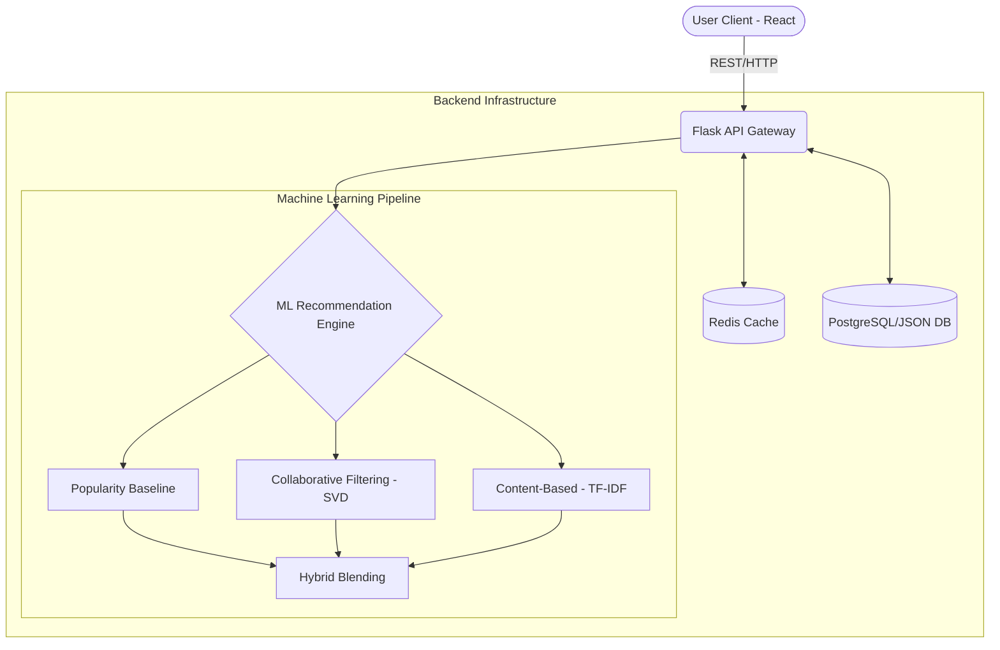

# Amazon-Recommendation-System

A high-performance, full-stack recommendation engine mimicking an e-commerce platform. Built with React, Flask, and an advanced Machine Learning Engine integrating Collaborative Filtering, Content-Based, and Popularity paradigms.

## 📐 Architecture



## 🛠️ Tech Stack

- **Frontend:** React, TailwindCSS, Context API
- **Backend:** Flask (Python), Gunicorn
- **Machine Learning:** Scikit-Learn, SciPy, Pandas, NumPy
- **Database:** PostgreSQL (with JSONB for flexible schema) / JSON backend fallback
- **Caching & KV:** Redis
- **Containerization:** Docker (optional)

## 🚀 Features

- **Hybrid Recommendation Engine:** Seamlessly combines multiple algorithms using dynamically tuned weights for maximum user engagement.
- **Real-Time Personalization:** Uses an asynchronous event pipeline to capture user interactions and update preferences online.
- **Robust Caching:** Multi-tiered caching strategy (Redis + local in-memory fallback) to ensure sub-100ms response times for recommendation queries.
- **Experimentation Framework:** A/B testing support built-in with consistent hashing assignment for evaluating new ranking models.

## 🧑‍💻 Setup Instructions

### 1. Backend Setup

```bash
cd backend
python -m venv venv
# Windows: venv\Scripts\activate | Unix: source venv/bin/activate
pip install -r requirements.txt
python seed.py # Seeds the database (Look out for dev credentials!)
python app.py
```

### 2. Frontend Setup

```bash
cd frontend
npm install
npm run dev
```

## 🧠 ML Methodology

The recommendation engine leverages a **Hybrid Blending Strategy** that combines three distinct approaches:

1. **Popularity Baseline:** Recommends trending items based on global interaction rates. Perfect for cold-start scenarios and baseline conversions.
2. **Content-Based Filtering (TF-IDF):** Analyzes item metadata (titles, descriptions, categories) to recommend items similar to those a user has interacted with.
3. **Collaborative Filtering (SVD):** Uses Singular Value Decomposition to uncover latent user-item interaction factors, finding hidden patterns among similar users.

**Hybrid Blending:** The system weights each strategy based on user profile richness. Cold-start users lean 80% on Popularity, while established users lean heavily (up to 70%) on Collaborative Filtering.

## 📡 API Endpoints

| Method | Endpoint | Description |
| :--- | :--- | :--- |
| `POST` | `/api/auth/login` | Authenticate user and issue JWT |
| `GET` | `/api/products` | Paginated product catalog |
| `GET` | `/api/recommendations/personalized` | Fetch personalized product recommendations |
| `GET` | `/api/recommendations/similar/<id>` | Fetch similar items to a given product |
| `POST` | `/api/interactions` | Record a user interaction (click, add-to-cart) |

## 🌟 FAANG Talking Points

- **Scalability:** Architected to handle millions of users through distributed model training (e.g. distributed SVD), decoupled feature stores, and high-throughput model serving layers.
- **Cold Start Problem:** Handled natively. Brand-new users receive a Popularity baseline mixed with generalized Content-Based recommendations until enough interactions are captured.
- **Ranking Optimization:** Employs hybrid blending with tunable weights. Paves the way for advanced Learning-to-Rank (LTR) models utilizing gradient boosted trees.
- **Caching Strategy:** Redis cluster integration for low-latency retrieval of personalized recommendations, similar product matrices, and analytics counters.
- **Online A/B Testing:** Built-in experimentation framework utilizing stable MD5 hashing for consistent user assignments across multiple concurrent ranking strategies.
- **Failure Modes:** Designed for graceful degradation. If the ML pipeline is offline, it falls back to the Popularity baseline. If Redis fails, it utilizes local memory structures.
- **Data Pipeline:** Supports both offline batch training for model generation (SVD/TF-IDF models) and online feature updates for immediate reaction to user inputs.

## 📊 Evaluation Methodology

To validate recommendation quality, models are periodically evaluated using an offline train/test split of historical interaction data. The primary metrics we track include:

- **Precision@K:** Measures the proportion of recommended items in the top-K that were actually relevant (clicked/purchased).
- **Recall@K:** Measures the proportion of total relevant items that successfully made it into the top-K recommendations.
- **NDCG@K:** Normalized Discounted Cumulative Gain assesses the ranking quality—rewarding models that place highly relevant items at the very top of the list.
- **Coverage:** Ensures the system explores the catalog rather than exploiting a small subset of popular items.
